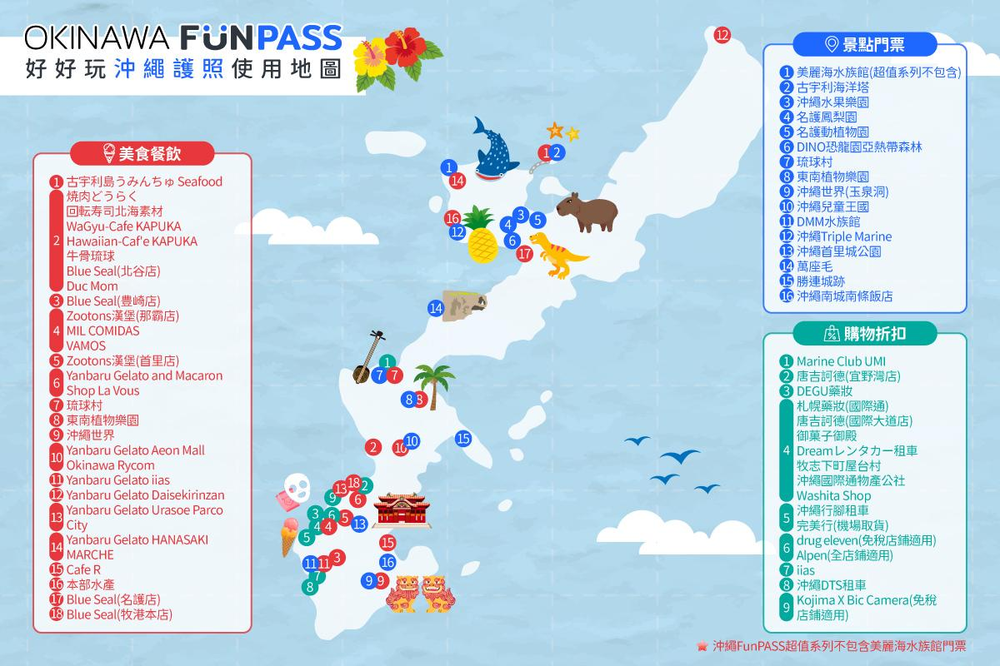
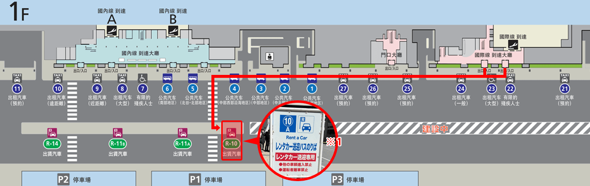

# 沖繩旅遊 Okinawa Trip 2026

> 🗓 **旅程期間：** 2026/04/23（抵達）～ 2026/04/27（離開）
> 🛣 **路線：** 台灣 → 那霸 → 南部 → 古宇利島（北部）→ 那霸 → 台灣
> 🚗 **租車：** MX-5（4/23）→ ROOMY（4/24 換車）

---

## 🗺 行程地圖 Trip Map

> 🔗 [**擎璇沖繩旅遊地圖（Google My Maps）**](https://www.google.com/maps/d/edit?mid=1TxWHlrQj86trb9a77O4JRLCSZdvDBXs&usp=sharing)  
> 景點 · 住宿 · 路線總覽 · 4/23 ~ 4/27

---

## 👥 旅行者資訊

| | 姓名 | 備註 |
|--|------|------|
| 👨 | 子擎 | |
| 👩 | 佩璇 | |

---

## ✈️ 機票資訊

**機票費用（雙人）$16,463 — 子擎媽媽訂票 · ✅ 已於 2026/02/22 轉帳**

### 去程 FD230 &nbsp; TPE → OKA &nbsp; 2026-04-23（四）

| 項目 | 內容 |
|------|------|
| 航空公司 | 泰國亞洲航空 Thai AirAsia |
| 訂位代號 | **K9ZT9S** |
| 起飛 | 桃園國際機場（TPE）第一航廈 **13:30** |
| 抵達 | 那霸機場（OKA）國際航廈 **15:55** |
| 飛行時間 | 1 小時 25 分 |
| 機型 | 空中巴士 A321 NEO |
| 艙等 | 經濟艙 Z |

| 旅客 | 免費托運 | 加購行李 |
|------|--------|--------|
| 子擎 YANG/TZCHING MR | 無 | **20 公斤** |
| 佩璇 ZHONG/PEIXUAN MS | 無 | — |

### 回程 IT231 &nbsp; OKA → TPE &nbsp; 2026-04-27（一）

| 項目 | 內容 |
|------|------|
| 航空公司 | 台灣虎航 Tiger Air Taiwan |
| 訂位代號 | **B8LE4D** |
| 起飛 | 那霸機場（OKA）**10:10** |
| 抵達 | 桃園國際機場（TPE）第一航廈 **10:40**（台灣時間）|
| 飛行時間 | 1 小時 30 分 |
| 機型 | 空中巴士 A320 |
| 艙等 | 經濟艙 |

| 旅客 | 免費托運 | 加購行李 |
|------|--------|--------|
| 子擎 YANG/TZCHING MR | 無 | **1 件，共 25 公斤** |
| 佩璇 ZHONG/PEIXUAN MS | 無 | — |

> ⚠️ 虎航托運限制：單件重量 ≤ 30 公斤・長寬高總和 ≤ 203 公分・任一邊 < 203 公分

---

## 🏨 住宿

| 日期 | 地點 | 住宿 | 房型 | 訂房者 | 金額 | 狀態 |
|------|------|------|------|--------|------|------|
| 4/23 | 那霸 | 那霸國際通大和 ROYNET 飯店 | 全新裝潢標準雙人房 | 擎媽 | **$2,555** | ✅ 已訂 |
| 4/24–4/25 | 古宇利島 | Private Condo Kourijima by Coldio Smart Resort | 海景公寓套房（8人）| 子擎 | JP¥80,340 ≈ **$16,000** | ✅ 已付款（4/1 子擎刷卡）|
| 4/26 | 那霸 | 沖繩縣廳前大和 ROYNET 飯店 | 標準雙人房 | 擎媽 | **$2,318** | ✅ 已訂 |

### 🏡 Coldio Smart Resort — 古宇利島 詳細

| 項目 | 內容 |
|------|------|
| 設施名稱 | Private Condo Kourijima by Coldio Smart Resort |
| 預約確認號碼 | 202602190000148 |
| 房型 | 海景公寓套房（1間，8人：6大人＋2兒童）|
| 到達日期 | 2026/04/24（五）**15:00** 起 |
| 退房日期 | 2026/04/26（日）**11:00** 前（延遲退房 JP¥5,000 / 60 分鐘）|
| 方案 | 官方網站有限價・寬敞公寓・共用游泳池・可欣賞古宇利橋景觀 |
| 預訂方式 | 子擎 官方網站線上預訂 |
| 網站 / TEL | https://coldioresort.com / 098-923-1420 |
| 預訂管理 | https://d-reserve.jp/guest-reserve-front/GMEM008F01000/GMEM008A01?hotelCode=0000000759 |
| 🔑 密碼提示 | 大寫 Y 開頭 |

**費用明細（6大人，兒童免費）：**

| 晚 | 日期 | 人數 | 單價 | 小計（JPY）| 台幣預估 |
|----|------|------|------|------|------|
| 第1晚 | 4/24 | 6 大人 | JP¥6,540 | JP¥39,240 | ~$7,993 |
| 第2晚 | 4/25 | 6 大人 | JP¥6,850 | JP¥41,100 | ~$8,372 |
| **合計** | | | | **JP¥80,340** | **~$16,365** |

> 🎉 **子擎姊姊請客！** 本次住宿（JP¥80,340 ≈ $16,000）由子擎姊姊全額負擔。  
> ✅ **4/1 子擎已刷卡預付 JP¥80,340**（子擎姊 3/31 轉帳 $16,000 給子擎）

---

### 🔑 入住方式（全自助，非常重要！）

> ⚠️ **這間是無人櫃台＋全自助入住**

**流程：**

1. **線上填寫入住資料**（出發前完成）  
   👉 [https://connect.minpakuin.jp/register/AAABQyDzN7NLMGT20BE2NlYMgbWO0uK7Rfk](https://connect.minpakuin.jp/register/AAABQyDzN7NLMGT20BE2NlYMgbWO0uK7Rfk)
2. **到現場平板輸入 Check-in Code** → 拿房間鑰匙

> ✅ **Check-in Code：343709**（4/1 系統已發送）

> ⚠️ **護照登記：所有客人（含預訂代表）辦理入住時均需登記護照，請提前準備好。**

> 💡 **家人先到可先入住**：把 Code **343709** 給他們，自行操作平板即可入住。

---

### 🍳 早餐

- 可現場加購
- 💰 JP¥3,500 / 成人
- 👶 每位成人可帶 2 位小孩免費

### 🅿️ 停車

- 每棟最多 2 台車

---

**取消政策：**
- 入住日前 8 日以上取消：免費
- 入住日前 7 日內取消：100%
- 當日取消 / 未入住：100%

---

## 🚗 租車（ORIX 租車）

> ⚠️ **Dream Rental Car 已全部取消**：原 MX-5 ＋ ROOMY（JP¥44,400）因車輛無法提供全部取消，退款待處理。

**預約號碼：** W7875932  
**取車：** 那霸機場店 外語對應專用櫃檯 · **4/23（四）17:00**（機場接送 ✅ FD230 · 快速取車 ✅）  
**還車：** 旭橋站西店 外語對應專用櫃檯 · **4/26（日）17:00**  
**車型：** EA CLASS Eco / EV（油電・電動）禁菸 · 大人 2 人  
**付款：** 網路刷卡 ✅（4/18 已付）

| 項目 | 金額 |
|------|------|
| 車輛租金（3天）| JP¥19,470 |
| 事故免責險 | JP¥3,300 |
| 租車安心優惠制度 | JP¥1,980 |
| **合計（含稅）** | **JP¥24,750（≈ $5,042）** |

> 💸 費用分攤待重新確認（Dream Rental Car JP¥44,400 退款後結算）

**取消手續費：**
- 取車日前 7 日：免費
- 6 日 ～ 3 日前：基本費用 20%
- 2 日 ～ 前日：基本費用 30%
- 取車日（4/23）：基本費用 50%（上限 JP¥6,000 不含稅）

### 📄 取車所需文件

1. 護照
2. 駕照日文譯本（來日前至台灣監理站辦理，譯本內容須與正本相同）
3. 本國駕照正本（有效期限內）

---

## 🎯 景點預訂

### 🎡 Okinawa FunPASS 5合一

> 🔗 [FunPASS 官方網站](https://okinawa.funpass.app/)  
> Klook 已訂購 ✅ — 憑證：[Klook-OKI-FunPass.pdf](<../docs/assets/Klook voucher-OKI-FunPass.pdf>)

**使用計畫：**

| 景點 | 使用日 | 備註 |
|------|--------|------|
| ✅ 達摩寺 聯名口金包 | D02（4/24）上午 | 每日限量 100 份・二樓右手邊取號・對面免費停車 |
| ✅ 古宇利海洋塔 | D03（4/25）上午 | — |
| ✅ 美麗海水族館 | D03（4/25）下午 | — |
| ⬜ 待選 | 東南植物樂園（夜間燈光秀）| D02 可選 |
| ⬜ 待選 | 古宇利島 うみんちゅ Seafood（套餐3選1）| D03 優先 |

---

### Valley of Gangala（山原之谷）

| 項目 | 內容 |
|------|------|
| 訂單編號 | D9ZBS0HJ |
| 預訂編號 | 6G3J6RST |
| 行程 | 【Perfect for International Guests!】含多語音導覽 |
| 日期時間 | 2026/04/24 10:00 |
| 人數 | 大人 × 2 |
| 預訂者 | 子擎（TzChing Yang）|
| 費用 | JP¥7,000（實付台幣 **$1,417**）|
| 付款 | ✅ 子擎信用卡（卡號末碼 0950，有效期 06/2028），3/4 請款 |
| 帳單顯示 | NUTMEGLABS JAPAN |
| 聯絡 | +81-98-948-4192 &nbsp;/&nbsp; confirmation@gangala.com |
| 地圖 | https://maps.app.goo.gl/ztxncYt6GwUu1UNh7 |

**取消政策：**

| 最後期限 | 取消費用 |
|--------|--------|
| 前一天 17:30 以前 | 0% |
| 出發 2 小時前以前 | 50% |
| 出發 2 小時前以後 | 100% |

---

## 🗺️ 行程時間軸 Trip Timeline

### D01 · 4/23（三） — 抵達那霸

| 時間 | 內容 |
|------|------|
| 08:30 | 🚗 出發（子擎 + 家人）前往桃園機場 |
| 10:30 | ✈️ 桃園國際機場 T1 報到 |
| 13:30 | 起飛 FD230（泰國亞洲航空）TPE → OKA |
| 15:55 | 🛬 抵達那霸機場（**國際航廈**）— 入境後搭**免費接駁巴士 11 號**至 **P2 停車場**候車 |
| 16:50 | 🚗 ORIX 接送抵達 → 取車（那霸機場店・外語對應・快速取車 ✅ · W7875932）|
| 17:30 | 離開機場，前往浦添 PARCO CITY |
| 18:00 | 🛍 PARCO CITY 逛街（2F The North Face 紫標・niko and... 狩獵帽・sora 逛 Patagonia）|
| 21:00 | 離開 PARCO CITY |
| 21:30 | 🛒 MaxValu 牧志 採買（爸媽可先到）— [地圖](https://maps.app.goo.gl/YhVRGPVxkXmqKA5g6)（約到 22:00）|
| 22:30 | 🏨 飯店停車（¥1,500）· Check-in 那霸國際通大和 ROYNET |
| 住宿 | 🏨 那霸國際通大和 ROYNET 飯店 |

> 🚌 **機場接駁**：抵達國際航廈後，搭**免費接駁巴士 11 號**往 **P2 停車場**，ORIX 車輛在此等候。  
> 🅿️ **飯店停車**：¥1,500 / 晚，請確認入口位置後再開入。

---

### D02 · 4/24（四） — 南部海景

| 時間 | 內容 |
|------|------|
| 09:00 | 🍡 達摩寺（FunPass 口金包兌換）— 每日限量 **100 份** · **二樓右手邊**取兌換號碼 · 對面**免費停車** |
| 09:30 | 🚗 出發往 Gangala（車程約 20 分鐘）|
| 10:00 | 🌿 Valley of Gangala 多語音導覽 ✅ #D9ZBS0HJ（約至 11:30）|
| 12:00 | 🌊 知念岬公園 |
| 12:30 | 🌉 NIRAIKANAI 大橋 |
| 13:00 | 🛒 沖繩 Costco（買東西車上吃，整理行李，開去卡丁車）|
| 15:00 | 🏎 [Original Street Kart 街頭 Go-Kart](https://maps.app.goo.gl/BB87K1qt7U2bZNKc6)（1 小時）✅ Klook 已訂（那霸市久茂地2丁目6-12）|
| 16:00 | 🏬 步行至 BicCamera 逛逛 |
| 17:30 | 🔀 分支選擇（擇一）：**A** 東南植物樂園（FunPass 夜間燈飾） / **B** [DUMBO Café](https://maps.app.goo.gl/fRrm61SxpeFmNNWh6) / **C** [A&W Makiminato](https://maps.app.goo.gl/25aQHYnLjQUYobyJA) |
| 19:30 | ☕ [BANTA CAFE](https://maps.app.goo.gl/Xs6EHBiqb5Srsuyi8) ✅ 已預約 — 預約 ID：**4702622**（美國村途中・到 20:30）|
| 21:30 | 🚗 前往古宇利島（車程約 1 小時）→ Coldio Smart Resort |
| 住宿 | 🏠 Coldio Smart Resort — 古宇利島 |

---

### D03 · 4/25（五） — 北部自然

| 時間 | 內容 |
|------|------|
| 09:45 | 🗼 古宇利海洋塔（FunPass 兌換 ✅）|
| 11:00 | 🍤 KOURI SHRIMP |
| 12:30 | 🍣 午餐 — 優先：うみんちゅ Seafood（FunPass 套餐3選1）· 備案：[L LOTA Restaurant](https://maps.app.goo.gl/) |
| 13:00 | 🛒 今歸仁村市場（爸媽採購晚餐食材）|
| 14:30 | 🐠 美麗海水族館（提早入場）|
| 15:00 | ⭐ 鯨鯊餵食秀 |
| 15:30 | 🪸 珊瑚礁餵食秀 |
| 17:00 | 🐬 海豚戶外表演 |
| 17:30 | 🌲 備瀨福木林道（conditional）— [Namiki Bike Rentals 腳踏車出租](https://maps.app.goo.gl/) |
| 18:30 | 🏠 抵達 Coldio Smart Resort |
| 晚餐 | 🍱 擎媽請客 — 飯店煮火鍋（食材今歸仁村市場採購）|
| 住宿 | 🏠 Coldio Smart Resort — 古宇利島 |

---

### D04 · 4/26（六） — 中部巡禮

| 時間 | 內容 |
|------|------|
| 11:00前 | 🧳 Coldio Smart Resort Check-out（退房 11:00 前，延遲 JP¥5,000/60min）|
| 10:30 | 🏬 AEON MALL Okinawa Rycom（2F mont-bell：U.L. Thermawrap Jacket 紫標・Travel Kit Pack M）|
| 14:00 | 🌆 美國村 逛逛拍照 |
| 15:00 | 🌅 瀨長島 Umikaji Terrace（conditional）|
| 17:00 | 🚗 還車 — ORIX 旭橋站西店 外語對應專用櫃檯（歸還前加滿油）· 接行李 → 飯店 Check-in |
| 18:00 | 🐟 牧志公設市場（到 22:00）→ 國際通散步 |
| 20:00 | 🥩 晚餐 — [Oniku no Isshin（お肉の一心）](https://maps.app.goo.gl/4F9TmhZZ7yG9TuqG6)（縣廳前，近住宿）✅ 已預約 **KZUHAW** · 4/13 子擎刷中信 Line Pay ¥200 訂金 · ⚠️ 24 小時內不可取消，取消費用每位 JP¥3,300 · 👨‍👩‍👧‍👦 子擎家人可能一起（前一天 4/25 晚看狀況確認）· 壽喜燒／日式火鍋擇一，精選黑毛和牛 ¥7,800 · 阿古豬 ¥6,980 · 沖繩豬 ¥3,800（備案：[肉屋 ししや](https://maps.app.goo.gl/fwpppMHApEdCNhrW7)）|
| 晚上 | 🛍 國際通購物 |
| 住宿 | 🏨 沖繩縣廳前大和 ROYNET 飯店 |

---

### D05 · 4/27（日） — 回程

| 時間 | 內容 |
|------|------|
| 07:10 | 機場集合（那霸機場）|
| 10:10 | 起飛 IT231 OKA → TPE |

---

## 👨‍👩‍👧‍👦 家人行程（爸媽 ＋ 姊一家四口）

> 與子擎、佩璇同期出發，各自安排行程，部分時段匯合。

### 🚐 包車資訊（葉子 易遊網訂）

| 日期 | 訂單號 | 車型 | 時間 | 備註 |
|------|--------|------|------|------|
| 4/24（四）| **ORD0029326932** | 10 人座 | 09:00 起，共 10 小時 | ⚠️ 需現付空車費 JP¥2,500 給司機（Coldio 不在市區）|
| 4/26（六）| **ORD0029327574** | 10 人座 | 09:00 起，共 10 小時 | |

**聯絡方式（當地中文客服）：**
- LINE：`dhlx2023`（QR Code 見訂購確認信附檔）
- WhatsApp：`+81-8033752621`

> 📱 客服將主動建立 WhatsApp 群組確認行程 ＋ 司機資訊，請留意通訊軟體邀請。

---

### 4/24（四）&nbsp; 09:00–19:00 — 南部文化

| 時間 | 內容 |
|------|------|
| 09:00 | 包車出發（ORD0029326932）|
| 上午 | 玉泉洞 |
| 下午 | 美麗海（午餐）|
| 傍晚 | 超市購物（飯店晚餐）|

### 4/25（五） — 古宇利自由活動

| 時間 | 內容 |
|------|------|
| 全天 | 古宇利島自由活動（同住 Coldio Smart Resort）|

### 4/26（六）&nbsp; 09:00–20:00 — 中部觀光

| 時間 | 內容 |
|------|------|
| 09:00 | 包車出發（ORD0029327574）|
| 上午 | 鳳梨園 |
| 下午 | 兒童王國 |
| 傍晚 | 美國村 |

---

## 💰 預算 Budget

### 住宿費用

| 日期 | 地點 | 飯店 | 晚數 | 金額 | 付款者 |
|------|------|------|------|------|--------|
| 4/23 | 那霸 | 那霸國際通大和 ROYNET 飯店 | 1 | $2,555 | 擎媽 ✅ 已訂 |
| 4/26 | 那霸 | 沖繩縣廳前大和 ROYNET 飯店 | 1 | $2,318 | 擎媽 ✅ 已訂 |
| 4/24–4/25 | 古宇利島 | Coldio Smart Resort | 2 | JP¥80,340（≈ $16,000）| 子擎姊請客 🎉 · 4/1 子擎刷卡預付 ✅ |
| **合計** | | | **4 晚** | **TWD ≈ $20,873** | 全數已確認 |

### 租車費用（ORIX 租車・台幣為主）

| 車型 | 期間 | 台幣 | 日幣 | 付款者 |
|------|------|------|------|--------|
| EA CLASS Eco/EV（ORIX）禁菸 | 4/23–4/26 · 3 天 | **$5,042** | JP¥24,750 | 子擎 刷卡 4/18 ✅ W7875932 |
| ~~MAZDA MX-5~~（Dream Rental Car 取消）| 4/23–4/24 | ~~$4,237~~ | ~~JP¥20,800~~ | ❌ 已取消・待退款 |
| ~~TOYOTA ROOMY~~（Dream Rental Car 取消）| 4/24–4/26 | ~~$4,808~~ | ~~JP¥23,600~~ | ❌ 已取消・待退款 |
| **合計（ORIX）** | | **$5,042** | JP¥24,750 | 匯率 ×0.2037 |

> 💸 費用分攤待重新確認（Dream Rental Car JP¥44,400 退款後結算）

### 其他費用

| 類別 | 台幣 | 備註 |
|------|------|------|
| 機票（雙人）| $16,463 | 子擎媽媽訂，子擎已轉帳 2/22 ✅ |
| Valley of Gangala | $1,417（JP¥7,000）| 子擎信用卡，3/4 請款（NUTMEGLABS JAPAN）✅ |
| 旅遊保險 | TWD 567 | 富邦旅平險計畫二 + 租車加購 ✅ |
| eSIM（日本）| TWD 287 | KKday 26KK231480251 ✅ |
| Go-Kart / FunPass 5合1 | — | Klook 已訂購 ✅ |
| 餐飲 ＋ 其他活動 | 待確認 | 浮潛、門票、餐廳 |

---

## 💸 帳目紀錄

| 日期 | 轉帳者 | 收款者 | 金額 | 管道 | 說明 | 狀態 |
|------|--------|--------|------|------|------|------|
| 2/22 | 子擎 | 子擎媽媽 | $16,463 | 銀行轉帳 | 機票全額 | ✅ 已確認 |
| 2/23 | 子擎 | Dream Rental Car | JP¥20,800 | 刷卡 | MX-5 租車費（已取消・待退款）| ❌ 已取消 |
| 2/23 | 子擎 | Dream Rental Car | JP¥23,600（$4,808）| 刷卡 | ROOMY 租車費（已取消・待退款）| ❌ 已取消 |
| 3/1 | 佩璇 | 子擎 | $7,101 | LINE Pay | 機票 $4,000 ＋ 租車 $3,101（⚠️ 租車部分待退款後重算）| ✅ 已確認 |
| 4/18 | 子擎 | ORIX 租車 | JP¥24,750（≈$5,042）| 刷卡 | EA CLASS Eco/EV 3天（4/23–4/26）· W7875932 | ✅ 已付款 |
| 3/31 | 子擎 | 擎媽（富邦帳號）| $4,873 | 銀行轉帳 | 那霸住宿費 4/23 $2,555 ＋ 4/26 $2,318（ROYNET 兩晚）| ✅ 已轉帳 |
| 3/31 | 佩璇 | 子擎 | $1,200 | LINE Pay | ROYNET 兩晚住宿分攤（$2,436 / 2 = $1,218，子擎贊助差額 $18）| ✅ 已確認 |
| 3/31 | 子擎姊 | 子擎 | $16,000 | 銀行轉帳 | 古宇利島住宿 2晚全額（Coldio Smart Resort）| ✅ 已確認 |
| 4/1 | 子擎 | Coldio Smart Resort | JP¥80,340 | 刷卡（預付）| 古宇利島住宿 2晚全額預付 | ✅ 已付款 |

---

## 🧳 沖繩行李配置 Okinawa Packing Plan

> 策略：衣物集中在託運（29"，兩人共用）· 設備集中在子擎登機箱（16"）· 佩璇登機箱 Moshi Costa

---

### ⚡ 快速判讀

| 角色 | 行李 | 用途摘要 |
|------|------|---------|
| 🔴 託運 | 29 吋（子擎額度，兩人共用）| 子擎 + 佩璇全部衣物、換洗、盥洗用品 |
| 🟡 子擎登機 | 16 吋 MUJI 深藍（40.5×31×19.5）| 空拍機機身、GoPro、充電器、線材（電池取出隨身）|
| 🟡 佩璇登機 | Moshi Costa 花崗岩灰（51×30×15）| 隨身外套、行動電源、佩璇駕照 |
| 🟢 子擎隨身 | Salomon 20L | 當日物品 + ⚡ 空拍機電池（必須隨身，不可託運）|
| 🟢 佩璇隨身 | Mystery Ranch Catalyst 18 | 佩璇當日物品 |
| 🟢 兩人證件 | Bellroy 腰包 7L（子擎配戴）| 兩人護照、兩人錢包、子擎駕照 |

**必記規則：**
- ⚡ **電池（LiPo）**：全部隨身，不可託運，不放 16 吋箱內，集中於 Salomon
- 📋 **佩璇無託運額度**（去程 / 回程均未加購），衣物全靠子擎額度
- 🎒 **件數控制**：必要時 Bellroy 可塞入 Salomon，合併為一件隨身包

---

### 📋 配置總表

| 類型 | 行李 | 尺寸 / 容量 | 攜帶者 | 放置內容 | 備註 |
|------|------|------------|--------|---------|------|
| 🔴 託運 | 29 吋行李箱（奶茶色） | 70 × 47 × 35 cm | 共用（子擎額度）| 子擎衣物 · 佩璇衣物 · 換洗衣物 · 內衣褲 · 睡衣 · 基本盥洗用品 | 子擎襪子與內褲免洗可丟 |
| 🟡 登機 | 16 吋行李箱（MUJI 深藍） | 40.5 × 31 × 19.5 cm | 子擎 | 空拍機機身 · GoPro · 充電器 · 線材 · 工具類 | 設備箱；電池取出另外隨身帶 |
| 🟡 登機 | Moshi Costa 商務手提袋（花崗岩灰） | 51 × 30 × 15 cm | 佩璇 | 隨身外套 · 行動電源 · 駕照 | ✅ 佩璇登機箱；51×30×15 ＜ 56×36×23，沒風險 |
| 🟢 隨身 | Mystery Ranch Catalyst 18（灰色） | 18 L | 佩璇 | 當日隨身物品 | 佩璇外出主包 |
| 🟢 隨身 | Salomon 20L | 20 L | 子擎 | 當日隨身物品 · ⚡ 空拍機電池 | 子擎外出主包；電池隨身位置 |
| 🟢 隨身 | Bellroy 腰包 | 7 L | 子擎 | 子擎護照 · 佩璇護照 · 駕照 · 錢包（兩人）| 最貼身；機場 / 景點防盜 |

---

### 🔔 29 吋行李箱（兩人共用衣物箱）

| 類別 | 說明 |
|------|------|
| 子擎衣物 | 上衣 · 長褲 · 短褲 · 睡衣 |
| 佩璇衣物 | 佩璇待確認 |
| 換洗 | 內衣褲 · 睡衣（各自）|
| 基本盥洗 | 洗面乳 · 牙刷牙膏 · 保養品等 |

> 💡 **可丟策略**：子擎的**襪子與內褲**為免洗一次性，可於旅途中逐步丟棄，減輕回程重量。  
> ⚠️ 僅子擎有託運額度（AirAsia 20 kg / Tiger Air 25 kg），**佩璇無加購託運**，本箱為兩人共用。

**重量策略 / 回程預留空間：**
- 出發時建議 29 吋預留 **3–5 kg 空間**，留給回程伴手禮與戰利品
- 重物優先由子擎託運額度承擔（額度較寬裕）
- 若回程仍超重，可將部分輕型物品轉移至 Salomon 或 Catalyst 隨身帶

---

### 📷 16 吋行李箱（子擎設備箱）

| 類別 | 內容 | 備註 |
|------|------|------|
| 空拍機機身 | — | 電池不在此，另外隨身 |
| GoPro 機身 | 機身 + 配件 | — |
| 充電器 · 線材 | 各機充電器、USB 線 | — |
| 工具類 | 轉接頭 · 備品 | — |

> ⚠️ **空拍機電池（LiPo）不可放在登機箱內**，必須單獨取出放隨身包（Salomon）隨身攜帶。

---

### 👜 Moshi Costa（佩璇手提行李）

| 內容 | 備註 |
|------|------|
| 隨身外套 | 飛機上 / 移動中快速穿脫 |
| 行動電源 | 禁止託運，必須隨身攜帶 |
| 駕照 | 佩璇駕照（子擎駕照在 Bellroy）|

> ✅ **登機箱確認（沒風險）**：Moshi Costa 51 × 30 × 15 cm 作為**佩璇登機箱**使用，三邊均在泰航上限 56 × 36 × 23 cm 以內。子擎用 16吋 MUJI（40.5×31×19.5）、佩璇用 Moshi Costa（51×30×15），兩人各佔一個登機箱 slot，沒有尺寸問題。

---

### ✈️ 航班行李規定對照

| 航段 | 航空公司 | 子擎 託運 | 佩璇 託運 | 手提規定 | 配置影響 |
|------|---------|---------|---------|---------|---------|
| TPE → OKA（FD230 4/23）| 泰國亞洲航空 Thai AirAsia | 20 kg（加購）| 無加購 ⚠️ | 每人 2 件，總重 **≤ 7 kg** 登機箱上限：56 × 36 × 23 cm 個人隨身包：40 × 30 × 10 cm | 注意雙人登機箱總重（≤7kg/人） ✅ 子擎 16"（40.5×31×19.5 ✓） ✅ 佩璇 Moshi（51×30×15 ✓）|
| OKA → TPE（IT231 4/27）| 台灣虎航 Tigerair Taiwan | 25 kg（加購・1件）| 無加購 ⚠️ | 每人 2 件，總重 **≤ 10 kg** 登機箱上限：54 × 38 × 23 cm | 較寬鬆，但仍需注意總重分配 |

> ⚠️ **佩璇無任何託運額度**：兩段航班均未加購。29" 行李箱以子擎額度託運，兩人共用。

---

### ✈️ 機場模式 / 登機件數控制

**標準登機件數（每人 2 件）：**
- 子擎：16 吋 MUJI 登機箱 + Salomon 20L 背包
- 佩璇：Moshi Costa 手提袋 + Mystery Ranch Catalyst 18 背包

**Bellroy 腰包應對策略：**
- 外出 / 一般時：Bellroy 貼身配戴（最安全，不佔件數）
- 登機時若地勤對件數嚴格：Bellroy 優先塞入 Salomon 20L，合併為一件
- 若現場無特別要求，Bellroy 可繼續貼身配戴，不必主動收起

> 💡 **核心原則**：每人登機 2 件（箱 + 包），若需要合併，Bellroy 塞入 Salomon 即可快速解決。

---

### ⚡ 鋰電池 / 行動電源規定

| 物品 | 放置方式 | 規定說明 |
|------|---------|---------|
| 空拍機電池（LiPo）| 🟡 隨身帶（Salomon）| 禁止託運；**不可放 16 吋登機箱**；須裝防靜電袋或原廠包裝；建議加保護盒或端子絕緣防止短路 |
| 行動電源 | 🟡 隨身帶（Moshi Costa）| 禁止託運；≤ 100Wh 不限，100–160Wh 需申報 |
| 空拍機機身 | 🟡 登機箱（16"）| 建議登機帶，避免行李遺失 |
| GoPro 電池 | 🟡 建議隨身帶 | 不建議放託運 |

> ⚠️ **電池集中管理**：LiPo 電池集中放於 Salomon 20L，建議使用保護盒或端子絕緣，避免短路。不可放在 16 吋登機箱，不可託運。  
> 出發前確認 **FD230（AirAsia）** 與 **IT231（Tiger Air）** 最新鋰電池政策。

📎 **參考連結**
- AirAsia 手提行李規定：https://support.airasia.com/s/article/What-are-the-rules-for-cabin-baggage-on-board?language=zh_TW
- 台灣虎航行李規定：https://www.tigerairtw.com/zh-tw/welcome-on-board/baggage

---

### 🗂 出行模式 / 風險備案

#### 外出模式
- 子擎：Salomon 20L（含電池 + 當日隨身物品）
- 佩璇：Mystery Ranch Catalyst 18（當日隨身物品）
- 兩人：Bellroy 腰包（兩人護照 + 財物，子擎貼身配戴）

#### 機場模式（安檢前確認清單）

| 行李 | 責任人 | 狀態 |
|------|--------|------|
| 29 吋行李箱 | 子擎（託運）| 衣物、盥洗，電池已取出 |
| 16 吋 MUJI | 子擎（登機）| 設備（電池已取出）|
| Moshi Costa | 佩璇（登機）| 外套、行動電源 |
| Salomon 20L | 子擎（隨身）| 電池集中此處 + 當日物品 |
| Catalyst 18 | 佩璇（隨身）| 佩璇當日物品 |
| Bellroy 腰包 | 子擎（貼身 or 塞入 Salomon）| 兩人護照 + 財物 |

#### 風險備案

| 情境 | 應對方式 |
|------|---------|
| 行李延誤 | 隨身包（Salomon / Catalyst）各放至少一套換洗衣物 |
| 行李超重 | 重物轉移至隨身包（Salomon 或 Catalyst）|
| 登機件數被要求 | Bellroy 塞入 Salomon，合併為一件隨身包 |
| 下雨 / 溫差大 | 外套放 Moshi Costa（容易拿取）|

---

### ⚠️ 待確認事項

| 項目 | 說明 |
|------|------|
| 佩璇衣物清單 | 29" 佩璇衣物尚未確認品項 |
| 空拍機電池最終位置 | 確認放 Salomon 或分裝（建議集中 Salomon）|
| 29" 行李箱空重 | 需確認是否影響可用載重 |
| 佩璇是否出發前加購託運 | 若衣物超重可考慮 |

---

## 🎒 待確認事項

- [x] 取得 Coldio Smart Resort **Check-in Code** — ✅ **343709**（4/1 系統已發送）
- [x] Original Street Kart 沖繩街頭 Go-Kart 體驗（D02）— ✅ 已預訂 **15:00**（原定 16:00 → 改 15:00）
- [x] D02 晚餐 — ✅ **Banta Cafe 為主**（4/24 19:30・ID 4702622）
  - A&W 若沒吃到，補吃順位：🥇 國際通（D04 晚） → 🥈 AEON Rycom（D04 白天） → 🥉 機場（D05）
- [x] D03 晚餐：擎媽請客 ✅ 預計飯店煮火鍋（當天早上確認是否要留車）
- [x] D04 Oniku no Isshin 訂位 ✅ KZUHAW（4/13 子擎刷卡 ¥200 訂金）
- [ ] D04 Oniku no Isshin — 家人是否一起（4/25 前一天確認人數，24h不可取消 ¥3,300/人）
- [ ] FunPass 5合一剩餘2項確認：東南植物園夜間燈飾 ／ 古宇利島うみんちゅ Seafood（套餐3選1）
- [x] 日幣兌換 — ✅ 子擎已兌換 **¥50,000**

---

## 📱 通訊 & 保險資訊

### 📡 行動網路 eSIM

| 地區 | 電信商 | 流量 | 天數 | 角色 | 平台 | 訂單號 | 費用 |
|------|--------|------|------|------|------|--------|------|
| 🇯🇵 日本（沖繩）| Rakuten / KDDI / Docomo | 無限流量 | 5 天 | 主力 | KKday | **26KK231480251** | TWD 287 |

📄 憑證：[Kkday-OKI-不限-5days.pdf](../docs/assets/Kkday-OKI-不限-5days.pdf)

> 💡 台灣出發前安裝，抵達 OKA（2026/04/23）後啟用；**5 日有效期從啟用日起算**，不使用時請勿提早啟用。

---

### 📶 實用提醒

- 📲 **出發前安裝**：eSIM 安裝需要 Wi-Fi，建議台灣出發前完成
- ⏱ **啟用時機**：抵達 OKA 後於「設定 → 行動服務」手動啟用
- 🔄 **三大電信自動切換**：Rakuten → KDDI → Docomo 依訊號強度自動選擇

---

### 🛡 保險資訊

#### 富邦旅平險（沖繩）

| 項目 | 內容 |
|------|------|
| 主約保單號 | **3226CT20D09791**（計畫二 / 組合9，300萬，TWD 524）|
| 附加保單號 | **3226CT20D09792**（租車加購保障，TWD 43）|
| 保障期間 | 2026/04/23 ~ 2026/04/27 |
| **總保費** | **TWD 567** |

**可申請情境：** 班機延誤 · 行李遺失 · 醫療費用 · 租車碰撞（附加）

| 保單 | 連結 |
|------|------|
| 旅平保單 | [富邦保單-OKI-旅平.pdf](../docs/assets/富邦保單-OKI-旅平.pdf) |
| 租車保單 | [富邦保單-OKI-租車.pdf](../docs/assets/富邦保單-OKI-租車.pdf) |

---

### 🎟 活動憑證 PDF

| 活動 | 憑證 |
|------|------|
| 🎡 FunPass 沖繩 5合1 | [Klook-OKI-FunPass.pdf](<../docs/assets/Klook voucher-OKI-FunPass.pdf>) |
| 🏎 街頭 Go-Kart（Original Street Kart）| [Klook-OKI-GoKart.pdf](<../docs/assets/Klook voucher-OKI-GoKart.pdf>) |
